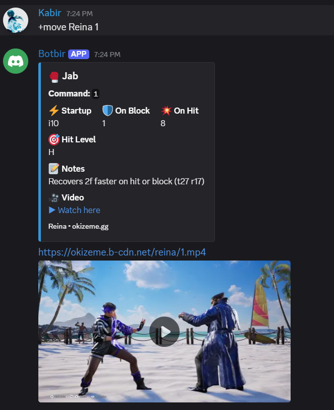

# Tekken Discord Bot

A Discord bot that fetches **frame data and move information** for Tekken characters directly from [Okizeme.gg](https://okizeme.gg).
The bot makes it easy to check frame data, watch move demonstrations, and quickly learn matchups — all without leaving Discord.

---

## 🚀 Features

* Fetch Tekken frame data with a simple command.
* Displays:

  * **Move name**
  * **Command input**
  * **Frame data** (startup, block, hit)
  * **Hit level**
  * **Notes**
  * **Video preview**
* Clean and stylish Discord embeds with emojis for better readability.
* Supports video playback of the move in action.

---

## 📖 Commands

The bot uses a simple template:

```
+move <character name> <move input>
```

**Examples:**

* `+move Reina 1`
* `+move Kazuya EWGF`
* `+move Jin 2,1`

---

## 📸 Example

Here’s how it looks in action:



---

## 🛠️ Setup & Installation

1. Clone the repository:

   ```bash
   git clone https://github.com/Kabir1240/tekken-discord-bot/
   cd Tekken-Discord-Bot
   ```

2. Install dependencies:

   ```bash
   pip install -r requirements.txt
   ```

3. Create a `.env` file and add your Discord bot token:

   ```
   DISCORD_TOKEN=your-bot-token
   ```

4. Run the bot:

   ```bash
   python main.py
   ```

---

## ⚡ Tech Stack

* **Python**

---

## 📌 Notes

* This project is not affiliated with Bandai Namco or Okizeme.gg.
* Built for the Tekken community to make learning frame data easier.

---

## 🔗 Related Project

Check out my other project:
👉 [Tekken Frame Data App](https://github.com/Kabir1240/TekkenFrameDataApp)

A standalone web app for browsing Tekken frame data in a clean and accessible way.

---
